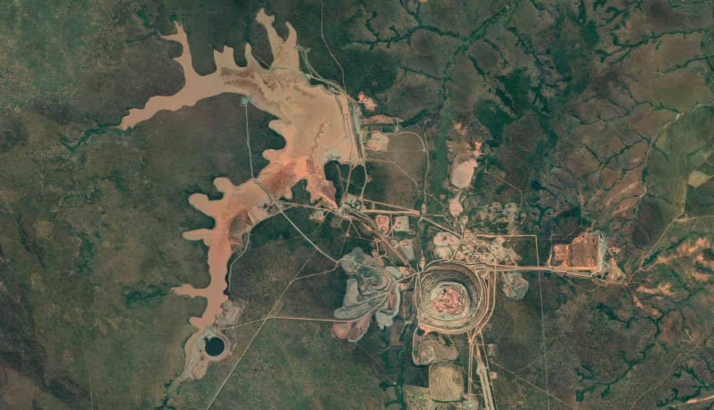

# Catoca Diamond Mine Tailings Dam Failure 2021
Using satellite imagery to assess pollution propagation from the 2021 tailings dam failure at the Catoca diamond mine in Angola

## Data Processing

### Sencast

Satellite data for the project was processed using [SenCast](https://gitlab.com/eawag-rs/sencast)

The file [Tshikapa_L1C_S2.ini](https://github.com/JamesRunnalls/tailings-dam-failures/blob/master/) in combination with [process.py](https://github.com/JamesRunnalls/tailings-dam-failures/blob/master/README.md) can be used to recreate the input data used in this project.

### Path Generation

This project uses [River Trace](https://github.com/JamesRunnalls/river-trace) in order to extract river profiles from the SenCast output.

## Results

The plot below highlights the differences in water turbidity, calculated using Acolite (see SenCast parameters above), 
for four days, one before the spill and three afterwards. The plot clearly highlights the pollution heading downstream.

